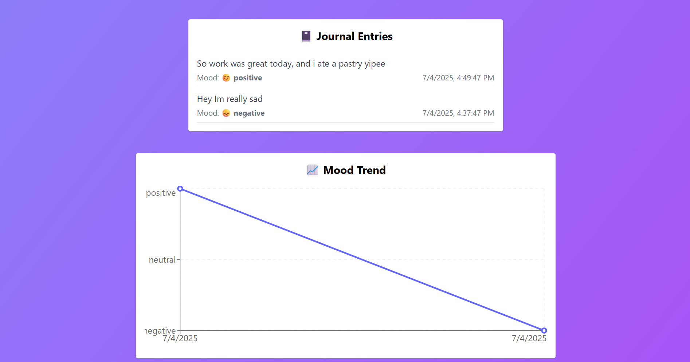
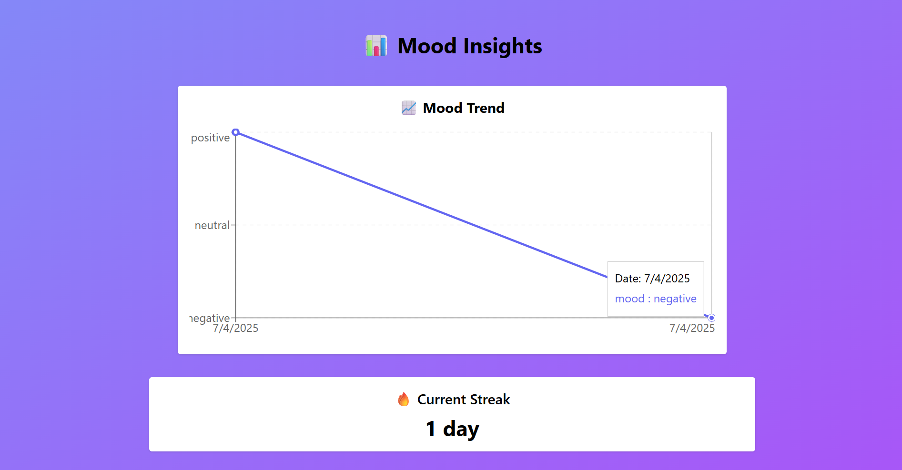

# 🧠 MindEase – Journaling & Mood Insight App

**MindEase** is a full-stack personal journaling and emotional reflection tool designed to help users cultivate self-awareness, mental clarity, and emotional resilience through regular text-based entries.

It integrates **NLP-based mood detection**, **interactive charts**, and **calendar-based filtering** to give insightful feedback on emotional trends over time.

---

## ✨ Features

### 📝 Journaling & Reflection
- Clean, distraction-free journaling interface.
- Entries are timestamped and stored securely in a SQL database.

### 💬 Sentiment Analysis (Dual Engine)
- **TextBlob (rule-based)**: Quick polarity analysis of journal entries.
- **BERT (`cardiffnlp/twitter-roberta-base-sentiment`)**: Transformer-based contextual sentiment classification.
- Displays both model predictions side-by-side for transparency.

### 📊 Mood Trend Chart
- Line chart of emotional tone over time using Chart.js.
- Helps visualize personal ups and downs.

### 📆 Calendar View + Mood Filter
- Filter past entries by **mood** or **date** using a calendar-based UI.
- Supports search for entries with specific emotional tone.

### 📈 Insights Dashboard (Planned / Partial)
- Streak tracker to promote consistency.
- Word clouds, entry stats, and more upcoming.

---

## 🧩 Tech Stack

### Frontend – `React.js + TailwindCSS`
- `React Router` for views
- `Chart.js` for trend visualizations
- `react-calendar` + `dayjs` for calendar filtering
- Clean, responsive UI with smooth transitions

### Backend – `FastAPI + Transformers`
- RESTful APIs for journal entry creation, retrieval, and analysis
- Sentiment analysis using:
  - `TextBlob` (rule-based)
  - `HuggingFace Transformers` (contextual, model-driven)
- `SQLAlchemy + SQLite` for ORM + DB
- Modular structure for easy extensibility

---

## 📁 Project Structure

Mindease/
├── mindease-backend/                    # 🧠 FastAPI Backend
│   ├── app/
│   │   ├── main.py                      # FastAPI app entry point
│   │   ├── models.py                    # SQLAlchemy DB models
│   │   ├── schemas.py                   # Pydantic request/response schemas
│   │   ├── database.py                  # DB config and session logic
│   │   └── routes/
│   │       └── journal.py               # Sentiment analysis + journal routes
│   └── requirements.txt                 # Python dependencies
│
├── mindease-frontend/                  # 💻 React Frontend
│   ├── src/
│   │   ├── components/
│   │   │   ├── JournalForm.jsx          # Journal input + mood detection
│   │   │   ├── EntryList.jsx            # Past entries list with mood/date
│   │   │   ├── MoodChart.jsx            # Line chart for mood over time
│   │   │   ├── InsightsView.jsx         # (Optional) Insights and trends
│   │   │   └── StreakTracker.jsx        # Entry streak tracker (optional)
│   │   ├── App.jsx                      # Main frontend layout + routes
│   │   └── index.js                     # App root file
│
└── README.md                            # 📄 You're here!

---

## 🚀 Getting Started

### 🔧 Backend Setup

```bash
cd mindease-backend
python -m venv venv
source venv/bin/activate        # On Windows: venv\Scripts\activate
pip install -r requirements.txt
uvicorn app.main:app --reload
```
### 💻 Frontend Setup

```bash
cd mindease-frontend
npm install
npm start
```
Make sure your backend is running on http://localhost:8000
--- 
### 📦 Dependencies
#### Backend
- fastapi
- uvicorn
- sqlalchemy
- textblob
- transformers
- pydantic

#### Frontend
- react
- axios
- chart.js
- react-chartjs-2
- dayjs
- react-calendar
- react-router-dom
- tailwindcss

### 🌱 Future Improvements
- Auth system (login/register with JWT)
- Mood-based journaling prompts
- Advanced NLP with LLM-based emotion tags
- WordClouds and emotion heatmaps
- Weekly email summaries
---
### 🖼️ Preview
### ✍️ Journal Entry Form


### 📊 Mood Trend Chart


### 📆 Insights

